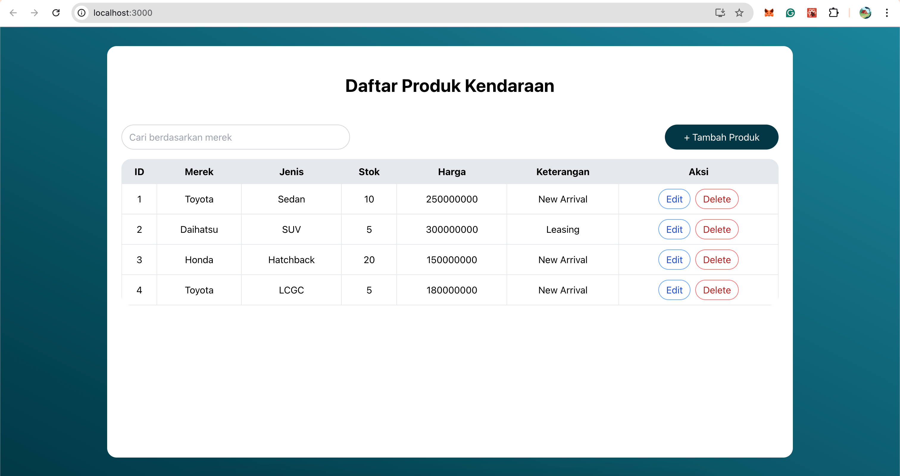
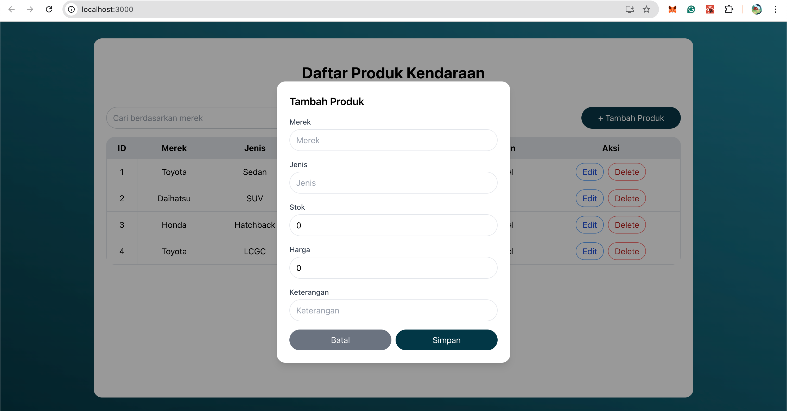
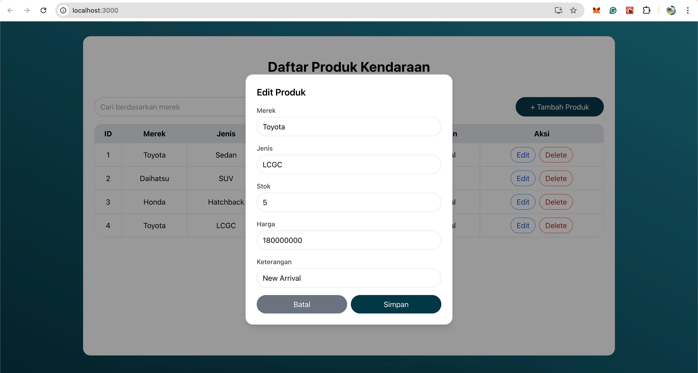
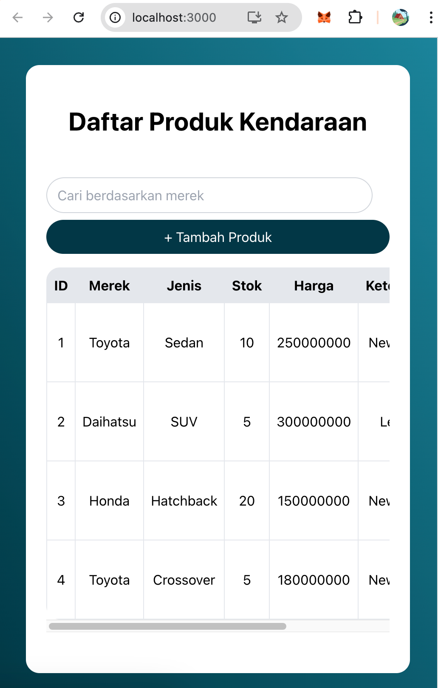

# 📦 XYZ Product Management App

This project was created as part of a Fullstack Developer take-home test for DSG.

It allows users to **view, add, edit, and delete** used vehicle (product) data.  
The backend is built with **Spring Boot**, and the frontend is built using **React.js** with **Tailwind CSS** for styling.

## ✨ Features

- View list of used product
- Search product by brand
- Add new product (with modal form)
- Edit existing product (with modal form)
- Delete product
- Responsive UI using Tailwind CSS


## ⚙️ Tech Stack

| Layer     | Technology                      |
|-----------|---------------------------------|
| Frontend  | React, Axios, Tailwind CSS (CDN)|
| Backend   | Spring Boot (Java 17), Spring Data JPA |
| Database  | H2 (in-memory)                  |
| Tooling   | Maven, Postman                  |

---


## 📸 Screenshots

| Home (List & Search) | Add Product Popup |
|----------------------|-------------------|
|  |  |

| Edit Product Popup | Responsive Mobile View |
|--------------------|------------------------|
|  |  |

> All screenshots are placed inside the `/screenshots` folder.

---

## 🚀 Getting Started

### 1. Clone this repository

```bash
git clone https://github.com/vanydiah/dsg-fullstack-vanydiah.git
cd dsg-fullstack-vanydiah
```


## 🚀 How to Run the Project

### Backend (Spring Boot)

```bash
cd xyz-backend
./mvnw spring-boot:run
# or
mvn spring-boot:run
```

### Frontend (React)
```bash
cd xyz-frontend
npm install
npm start
```
Runs the frontend server at: http://localhost:3000

Make sure the backend is running before starting the frontend.

## 📌 Notes

✅ For simplicity and faster development, Tailwind CSS is included via CDN.

✅ Data is stored using H2 in-memory database, so it resets every time the server restarts.

## 📁 Folder Structure
```bash
dsg-fullstack-vanydiah/
├── xyz-backend/       # Spring Boot API
├── xyz-frontend/      # React + Tailwind frontend
├── screenshots/       # UI screenshots for README
└── README.md          # Project documentation
```

## 👩‍💻 Author

Vany Diah Puspitasari

Frontend & Fullstack Developer

🌐 [https://vanydiah.framer.website]

🌐 [https://vanydiah.carrd.co]

📧 [vanydiah17@gmail.com]


